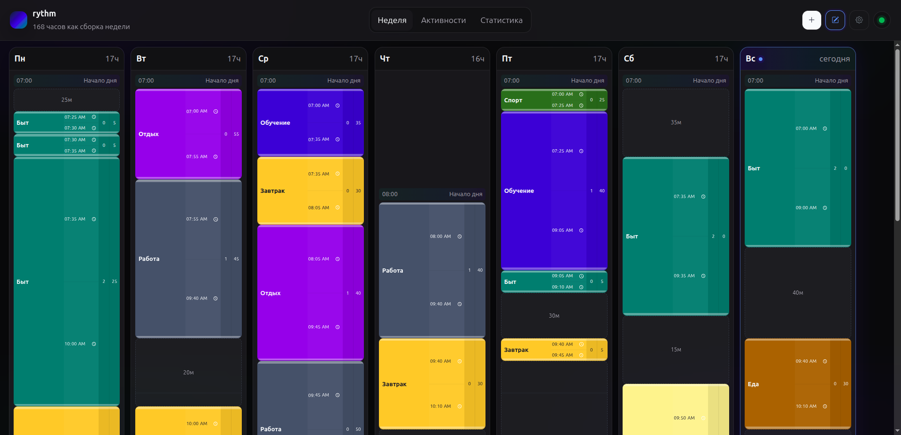

# rythm

> [!] ВНИМАНИЕ! Код в этом проекте написан ИИшкой за 3 дня. Ни одна строка кода не была написана мной самолично. Так что не судите о качеству моего кода по этой репе. Тут можно посмотреть на UX, флоу, и тп, не более.



Личный PWA-инструмент для сборки повторяющегося недельного жизненного ритма: активности, логические дни, статистика по 168 часам и офлайн-редактирование с синхронизацией по принципу "более свежая версия побеждает".

Фронтенд работает без CDN: Svelte собирается Vite в `public/assets`, Bootstrap 5 CSS и Bootstrap Icons лежат локально в `public/vendor`.
Файлы `public/vendor` должны быть в git: Docker-сборка не ходит в CDN и проверяет их наличие во время `npm run build`.
Файлы `public/index.html`, `public/sw.js` и `public/assets` генерируются командой `npm run build` из `public/index.template.html`, `public/sw.template.js` и Vite manifest; их не нужно коммитить.

## Локальный запуск

```bash
npm install
npm run build
npm run dev
```

Приложение откроется на `http://localhost:3000`.

## Пароль

Для Docker/VPS удобнее создать `.env` интерактивно:

```bash
npm run setup:env
```

Команда спросит порт и пароль приложения, сгенерирует `RYTHM_PASSWORD_HASH` и `RYTHM_COOKIE_SECRET`, затем запишет `.env` для `docker compose`.

Если нужен только хеш пароля:

```bash
npm run hash-password -- "my-password"
```

Если `RYTHM_PASSWORD_HASH` пустой или настройка `authEnabled` выключена в интерфейсе, приложение работает без пароля.

## Docker

```bash
docker compose up -d --build
```

Состояние хранится в `data/state.json`, бэкапы последних снимков лежат в `data/backups`.

## Деплой на VPS

На сервере нужны git, Docker и Docker Compose. Node.js/npm на VPS не нужны: `npm ci` и `npm run build` выполняются внутри Docker-образа из `Dockerfile`.

По умолчанию используется SSH host `frity.vds` и директория `/var/www/rythm.frylo.org`:

```bash
npm run deploy:vps
```

Скрипт заходит по SSH, делает `git pull --ff-only`, затем `docker compose up -d --build --remove-orphans`. Хешированные `public/assets`, `public/index.html` и `public/sw.js` собираются внутри Docker build, коммитить их не нужно.

Переопределить параметры можно через локальные переменные окружения или файл `.env.deploy`. Шаблон лежит в `.env.deploy.example`:

```bash
RYTHM_DEPLOY_HOST=my-vps
RYTHM_DEPLOY_USER=root
RYTHM_DEPLOY_PASSWORD=optional-ssh-password
RYTHM_DEPLOY_DIR=/opt/rythm
RYTHM_DEPLOY_BRANCH=main
```

Если задан `RYTHM_DEPLOY_PASSWORD`, локально нужен `sshpass`. Без пароля используется обычный SSH, например через ключи. На сервере директория `$RYTHM_DEPLOY_DIR` должна быть git checkout проекта; `.env` для контейнера лежит там же.
